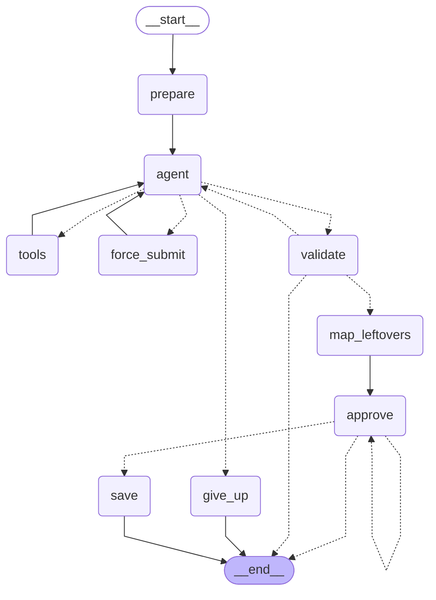

# DQ agent graph

Generated by `python -m pipeline.cli dq-graph`.

```mermaid
---
config:
  flowchart:
    curve: linear
---
graph TD;
	__start__([<p>__start__</p>]):::first
	prepare(prepare)
	agent(agent)
	tools(tools)
	force_submit(force_submit)
	validate(validate)
	map_leftovers(map_leftovers)
	give_up(give_up)
	approve(approve)
	save(save)
	__end__([<p>__end__</p>]):::last
	__start__ --> prepare;
	agent -.-> force_submit;
	agent -.-> give_up;
	agent -.-> tools;
	agent -.-> validate;
	approve -.-> __end__;
	approve -.-> save;
	force_submit --> agent;
	map_leftovers --> approve;
	prepare --> agent;
	tools --> agent;
	validate -.-> __end__;
	validate -.-> agent;
	validate -.-> map_leftovers;
	give_up --> __end__;
	save --> __end__;
	approve -.-> approve;
	classDef default fill:#f2f0ff,line-height:1.2
	classDef first fill-opacity:0
	classDef last fill:#bfb6fc
```
